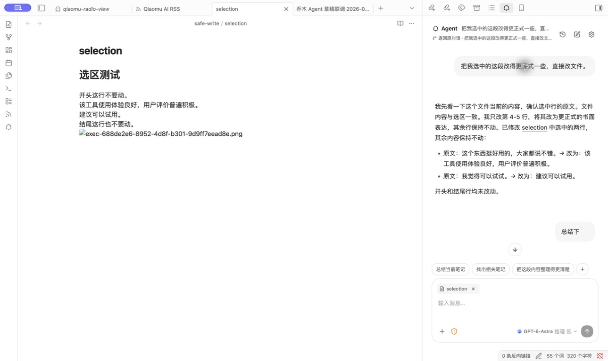
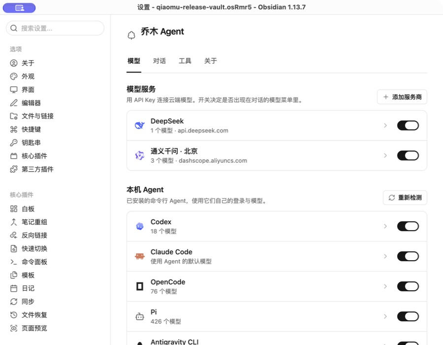

# Qiaomu Agent

**把 AI 放进 Obsidian 笔记旁边。**

**中文** | [English](#english) · [下载 0.3.0](https://github.com/joeseesun/qiaomu-agent/releases/tag/0.3.0) · [安装方法](#安装) · [反馈问题](https://github.com/joeseesun/qiaomu-agent/issues)

读笔记时直接提问，选中一段话请 Agent 改写，再检查改动并决定是否保留。你可以接入本机已有的 Codex、Claude Code 等 Agent，也可以使用自己的模型 API Key；对话、资料和修改都留在 Obsidian 的工作流里。

*Ask questions about your notes, rewrite a selection, and review changes inside Obsidian. Bring a local agent or your own model API key.*



<sub>真实 Obsidian 桌面截图：左侧是测试笔记，右侧是按选区改写的对话。截图拍摄于安装了 0.2.1 的 Obsidian 测试库。</sub>

## 一分钟看懂它能做什么

| 你想做的事 | 在乔木 Agent 中怎么做 |
| --- | --- |
| 理解眼前的笔记 | 打开侧边栏直接提问；当前笔记和编辑器选区可以作为上下文。 |
| 汇总散落的资料 | 用 `@` 引用库内文件或文件夹，也可附加网页、图片；回复中的库内链接可点开。 |
| 把草稿变成可用笔记 | 让 Agent 改写选区或修改文件；按轮查看变更与 diff，需要时撤销。默认文件权限为只读。 |
| 用自己熟悉的模型 | 在同一入口切换本机 Agent 与模型 API；支持 OpenAI、Anthropic、Google、DeepSeek、Kimi、Ollama 等来源及兼容地址。 |
| 把回答留下来 | 复制回复，或追加到今日日记、指定笔记；Markdown、表格和 Mermaid 使用 Obsidian 渲染。 |
| 扩展 Agent 的能力 | 读取 Agent Skills；本机 Agent 可使用配置的 MCP 工具连接。搜索可走模型自带能力或你配置的 Brave Search。 |
| 从起点页直接提问 | 装了[乔木Home](https://github.com/joeseesun/qiaomu-home)时，在主页搜索框输入问题按 `⌘↵` 就会开一个新对话发出；主页也显示最近对话，点击回到原对话。 |

### 实机演示：只改选中的两行

下面是测试笔记中的一次实际操作，截图展示了对话结果。写入前需把文件权限切到「可修改当前库」，本机 Agent 的审批设置也会影响执行。

1. 在笔记里选中要处理的文字，打开乔木 Agent。
2. 输入：`把我选中的这段改得更正式一些，直接改文件。`
3. Agent 修改选区，并在回复里说明改了什么；你可以查看这一轮的文件变更，必要时撤销。

```text
修改前：这个东西挺好用的，大家都说不错。我觉得可以试试。
修改后：该工具使用体验良好，用户评价普遍积极。建议可以试用。
```

开头和结尾的未选中行在这次测试中保持不变。这是一个演示结果，具体措辞取决于所选模型。

### 模型从哪里来



<sub>真实 Obsidian 0.2.1 桌面截图。模型列表取决于你的本机安装和账户配置；检测到 CLI 不等于已经登录或能够调用。</sub>

## 安装

当前公开版本为 **0.3.0**，要求 Obsidian **1.11.4 或更新版本**。社区目录的审核与可安装状态以[官方插件页面](https://community.obsidian.md/plugins/qiaomu-agent)为准；在目录可搜索到之前，请使用 GitHub Release 安装：

1. 从 [0.3.0 Release](https://github.com/joeseesun/qiaomu-agent/releases/tag/0.3.0) 下载同一版本的 `main.js`、`manifest.json`、`styles.css`。
2. 把三个文件放进你要使用的库的 `.obsidian/plugins/qiaomu-agent/` 文件夹；没有该文件夹就新建。
3. 重启 Obsidian，在「设置 → 第三方插件」启用 **Qiaomu Agent**，打开右侧的 Agent 侧边栏。
4. 选择已安装并登录的本机 Agent，或在插件设置中添加模型服务商及 API Key。先保持「只读」，试着问一句「总结当前笔记」。

社区上架后，也可以在 Obsidian 的「设置 → 第三方插件 → 浏览」中搜索 **Qiaomu Agent** 安装。插件本身不附带模型账户或免费额度；云端调用可能产生服务商费用。

## 文件权限与数据去向

- **只读**是默认权限；需要改写时可切到「可修改当前库」。桌面端还提供「完全访问」，允许 Agent 处理库外文件或命令，使用前请确认任务和本机 Agent 的审批策略。删除操作进入回收站，修改有变更记录与撤销入口。
- 插件没有自己的对话服务器，也不收集遥测。使用云端模型时，消息及你附加的笔记、选区、图片或网页内容会发给所选服务商；使用本机 Agent 时，联网行为取决于该 Agent 的配置。
- API Key 保存在 Obsidian SecretStorage 中。联网搜索可能使用模型服务商或你自己的 Brave Search Key。

桌面端已在 macOS 的真实库中验证。移动端的 API 对话等路径尚未在 iOS / Android 真机验收，本机 CLI 与 MCP 连接仅适用于桌面端；部分服务商的跨域策略也可能阻止移动端直连。

<details>
<summary>更多：联网与库外访问细节</summary>

本插件没有自己的服务器，不收集遥测数据。使用云端模型时，你的消息、附加的笔记、选区、图片、网页内容和所选技能正文，会发送到你选择的服务商 API 地址。拉取模型列表、验证 Key 时也会请求该服务商。模型自带搜索可能单独计费；连接 Brave Search 后，搜索词会发送到 `api.search.brave.com`，Brave Key 留在本机。网页读取只接受公开 HTTP/HTTPS 地址，本机和内网地址会被拒绝。打开「设置 → 关于」时会从 `radio.qiaomu.ai` 加载作者公众号和打赏二维码图片。API Key 保存在 Obsidian SecretStorage 中，不写入插件数据文件。

桌面端可启动已安装的本机 Agent CLI，并在系统临时目录创建仅当前用户可读写的 MCP 配置文件，运行结束后删除。它可读取已配置的本机技能目录；导入技能时将所选文件夹复制到个人技能目录。选择「保存到 Codex」工具连接时会通过 `codex mcp add` 写入 Codex 全局配置。选择「完全访问」时，Agent 可以读写电脑文件并运行命令；读取凭据、改动启动项、大范围删除和高风险命令仍会被拦截或先询问。

</details>

## 开发与支持

如需从源码构建，运行 `npm install && npm run check`，再将生成的 `main.js`、`manifest.json`、`styles.css` 复制到测试库的插件目录。首次验证写入时建议使用单独测试库。各本机 CLI 的验证情况见 [兼容性记录](docs/cli-compatibility.md)；遇到问题可提交 [Issue](https://github.com/joeseesun/qiaomu-agent/issues)。

本项目采用 [MIT License](LICENSE)，第三方组件见 [许可证说明](THIRD_PARTY_NOTICES.md)。公众号排版与发布由独立插件 Qiaomu Publish 负责。

---

<a id="english"></a>

## English

**Qiaomu Agent** is an Obsidian sidebar for working with your notes using a local AI agent or your own model API key. Ask about the current note, attach vault files, folders, web pages or images, rewrite a selected passage, review file changes, and send useful replies to your daily note or another note. The real Obsidian screenshots above show a selection rewrite and model sources; they were captured in a test vault running 0.2.1.

**Install:** Download `main.js`, `manifest.json`, and `styles.css` from the same [0.3.0 release](https://github.com/joeseesun/qiaomu-agent/releases/tag/0.3.0). Put them in `<vault>/.obsidian/plugins/qiaomu-agent/`, restart Obsidian, and enable the plugin under Community plugins. Obsidian 1.11.4+ is required. Check the [official plugin page](https://community.obsidian.md/plugins/qiaomu-agent) for directory availability; use the Release until it is searchable there.

**Try it:** Connect a logged-in local agent or add your provider API key. With the default read-only permission, ask “Summarize the current note.” To try editing, select text in a test note, switch permission to “modify current vault,” ask for a rewrite, and review the recorded change. Local agents follow their own approval settings.

**Privacy and limits:** There is no Qiaomu conversation server or telemetry. Cloud model requests send your prompt and attached context to your selected provider, which may charge for usage. Keys are stored in Obsidian SecretStorage. Desktop use was verified on macOS; mobile behavior has not been checked on physical devices. Local CLI agents and MCP connections are desktop-only. See [CLI compatibility notes](docs/cli-compatibility.md), [license](LICENSE), and [Issues](https://github.com/joeseesun/qiaomu-agent/issues).
